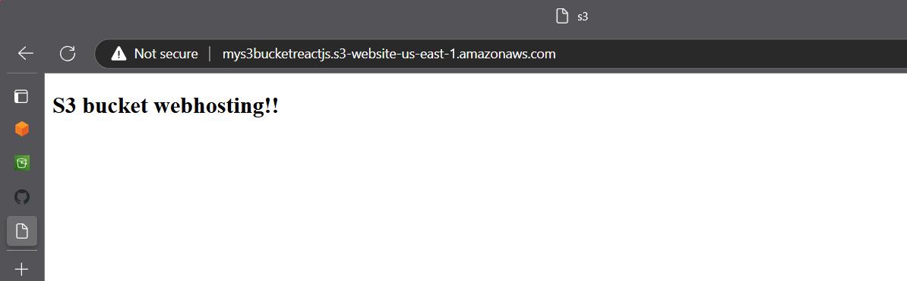

# Ansible-s3-webhosting-project
Web Hosting AWS S3 Bucket using Ansible playbook

## Application Screenshot




This guide outlines the steps to set up an S3 bucket with static website hosting using an Ansible playbook. The project involves creating an S3 bucket, configuring it for static website hosting, setting IAM permissions, and deploying the necessary HTML files.

## Project Files

- **404.html**: Custom error page for the website.
- **create-s3.yml**: Ansible playbook to create the S3 bucket and configure it.
- **cred.yml**: Contains AWS credentials and configurations.
- **index.html**: Main landing page for the static website.
- **policy.json.j2**: Jinja2 template for the S3 bucket policy.

---

## Prerequisites

1. **Ansible Installed**:
   - Ensure Ansible is installed on your control node.
   - Install required Ansible collections (e.g., `amazon.aws`).

2. **AWS CLI Installed**:
   - Install and configure the AWS CLI with necessary credentials.

3. **AWS IAM Role/User**:
   - Create an IAM role/user with the necessary permissions to manage S3 buckets and policies.

---

## Step-by-Step Guide

### Step 1: Clone the Repository

Clone the project repository to your local system:
```bash
git clone <repository-url>
cd ansible-s3-webhosting-project
```

### Step 2: Configure Credentials

Edit the `cred.yml` file with your AWS access and secret keys. Ensure the credentials have permissions to create and manage S3 buckets.

### Step 3: Define Variables

Update the `create-s3.yml` playbook with variables for:
- S3 bucket name
- Region
- Website configuration (e.g., index and error pages)

### Step 4: Execute the Playbook

Run the Ansible playbook to create the S3 bucket and configure it for static website hosting:
```bash
ansible-playbook create-s3.yml
```

### Step 5: Upload Website Files

The playbook will use the `index.html` and `404.html` files to set up your website content. Ensure these files are in the same directory as the playbook.

### Step 6: Verify Static Website Hosting

1. Open the S3 bucket in the AWS Management Console.
2. Check the bucket's website endpoint under the "Properties" tab.
3. Verify the website is accessible and displays the content of `index.html`.

---

## Troubleshooting

- **Bucket Not Found**: Ensure the bucket name is unique and complies with AWS naming conventions.
- **Access Denied**: Verify IAM permissions in the `policy.json.j2` template and AWS credentials in `cred.yml`.
- **Website Not Loading**: Check if the bucket is configured as a public static website and the correct files are uploaded.

---

## Example Commands

```bash
# Run the playbook
ansible-playbook create-s3.yml

# Validate bucket policy
aws s3api get-bucket-policy --bucket <bucket-name>

# List bucket contents
aws s3 ls s3://<bucket-name>/
```

---

Happy Hosting!

